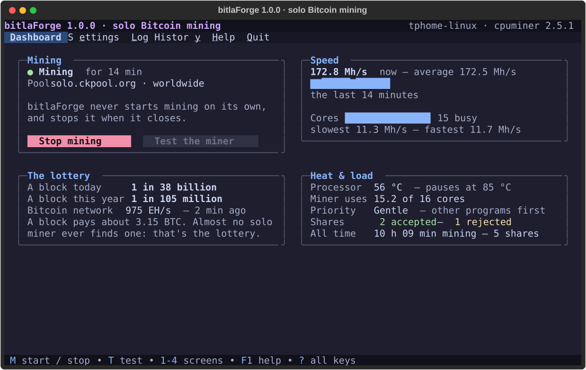
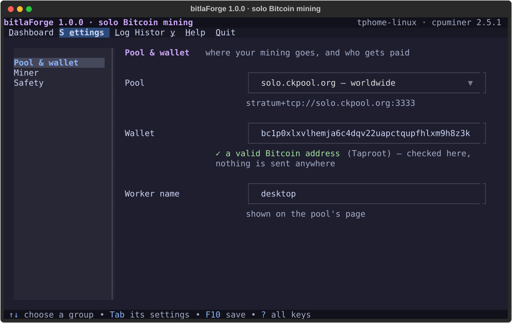
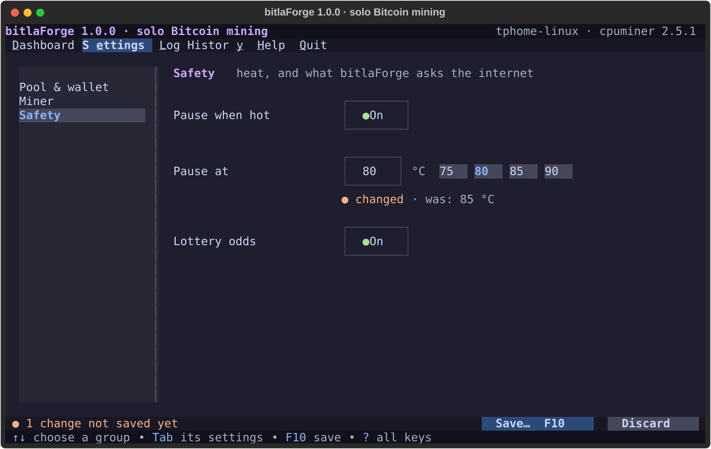
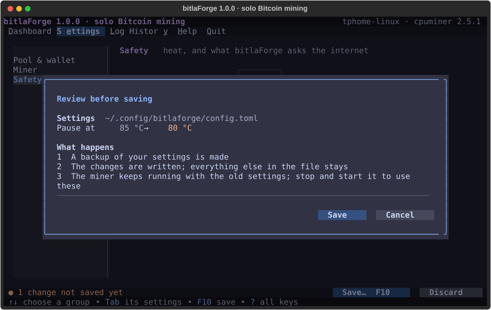
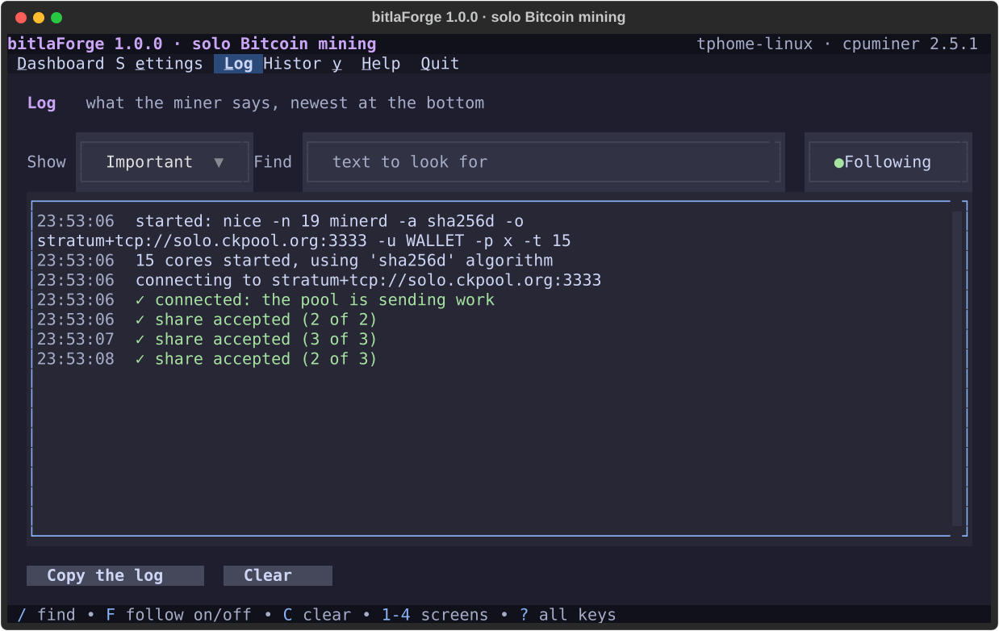
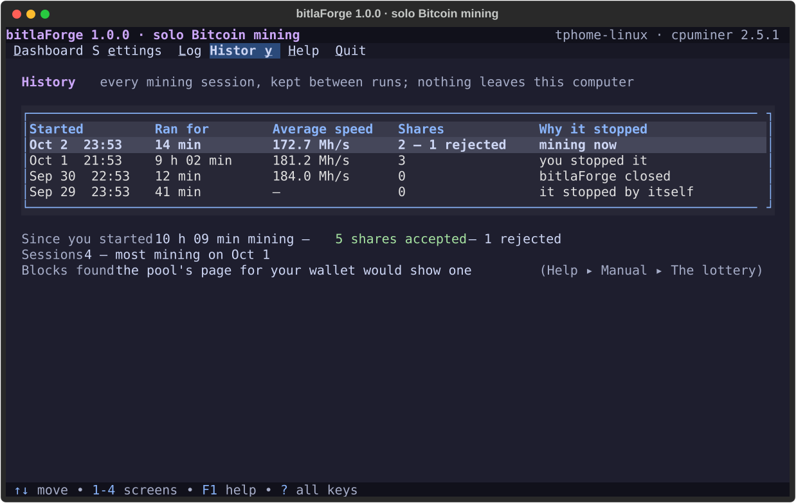
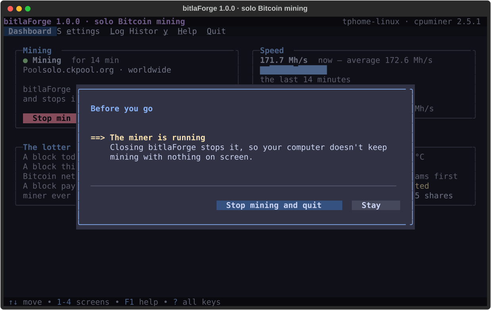

# ⚡ bitlaForge

> Solo Bitcoin mining, honestly framed: start and stop the miner, watch it work, and see your real chance of finding a block. It never starts mining on its own, and it stops the miner when it closes.


[](https://aur.archlinux.org/packages/bitlaforge)

> 🛡 **Security** — every release is GPG-signed and every commit is GitHub-Verified. **[Where We Stand](https://github.com/jetomev/KognogOS/blob/main/docs/where-we-stand.md)** covers our response to the 2026 AUR supply-chain attacks and how to check us yourself.

---

## Why bitlaForge?

Bitcoin mining is a race to guess a number. Mining **solo** means your computer guesses alone: if it wins, the whole block reward (about 3 bitcoin) is yours; almost certainly, it never wins. On 2 October 2026 a 16-core desktop had about **1 in 36 billion** chance per day, or **1 in 98 million** per year.

That's the game: a lottery ticket your processor keeps buying. **bitlaForge is the screen you watch it from.** It runs the miner (`minerd`, from the cpuminer project), shows what it's doing in plain words, keeps your sessions, and tells you your real odds instead of pretending.

> **This is a hobby, not income.** Mining uses real electricity and makes real heat; expect to spend more on power than you'll ever earn. Do it because it's interesting.

---

## Features

- 🏠 **Dashboard**: is it mining, how fast (with a chart of the last 30 minutes and a bar per core), is it safe (processor temperature, how much of the processor the miner uses), and **your real chance** of finding a block today and this year.
- 🔧 **Settings** as a form, in three groups: **Pool & wallet** (solo pools picked from a list; your wallet **checked as you type, on your computer**), **Miner** (cores to use, a gentle priority), **Safety** (pause when hot, the lottery odds).
- 📜 **Log** in plain words: *share accepted*, *share rejected* and why, *can't reach the pool*, *paused for heat*. Filter, find, follow. Your wallet is never shown.
- 🗂 **History**: every session, kept between runs, with why it stopped, and the totals since you started.
- 🌡 **Pause when hot**: the miner is paused when the processor reaches 85 °C (your choice), and goes on by itself when it cools.
- 🎲 **The lottery, honestly**: once an hour, mempool.space is asked how big the Bitcoin network is. Nothing about you is sent, and a switch turns it off.
- 🛑 **The miner never outlives bitlaForge**: closing asks first, then stops it; if bitlaForge itself were to crash, the system stops the miner with it.
- 💾 **Save with a review**: **F10** shows every change, old → new, makes a backup first, and keeps everything else in the file.
- 📖 **A manual inside the app** (Help ▸ Manual), and **F1** on any setting opens its page.
- 🐧 **Every major distribution**, tested with each one's own miner; readable on a plain text console; nothing cut off at 100 columns.

Built on [forgekit](https://github.com/jetomev/forgekit), the Forge Suite's shared base, so it looks and works like grubForge and alacrittyForge.

---

## Screenshots

### Mining


### Settings, with the wallet checked as you type


### Safety


### Review before saving


### Log


### History


### Closing while mining


*The pictures come from the running app (`python docs/screenshots/generate.py`), with a stand-in miner and an example wallet from Bitcoin's own specification.*

---

## Requirements

- Linux, Python 3.11 or newer
- `python-textual`, `python-rich`, `python-tomlkit` and [`python-forgekit`](https://github.com/jetomev/forgekit) 0.5.1 or newer
- `util-linux` (for `setpriv`, already on every distribution)
- **`minerd`** to actually mine (see below); bitlaForge runs without it and says how to get it

---

## Installation

### Arch Linux and KognogOS, from the AUR (recommended)

```bash
nog install bitlaforge      # KognogOS
nog install cpuminer        # the miner itself (minerd)
```

With any other AUR helper: `yay -S bitlaforge` and `yay -S cpuminer`.

### Any other distribution

```bash
git clone https://github.com/jetomev/bitlaforge.git
git clone https://github.com/jetomev/forgekit.git
cd bitlaforge
python3 -m venv .venv && .venv/bin/pip install textual rich tomlkit
PYTHONPATH=../forgekit .venv/bin/python main.py
```

A virtual environment is used because most distributions refuse `pip install` into the system Python.

### Getting the miner

Tested on 2 October 2026 in a fresh install of each:

| Distribution | How |
|---|---|
| Arch, KognogOS | `nog install cpuminer` (AUR) |
| openSUSE Tumbleweed | `sudo zypper install cpuminer` |
| Debian 13, Ubuntu 24.04, Fedora 44 | not packaged: the cpuminer project's own [ready-made program](https://github.com/pooler/cpuminer/releases/tag/v2.5.1) (`pooler-cpuminer-2.5.1-linux-x86_64.tar.gz`), unpacked and installed to `/usr/local/bin/minerd`. The step-by-step is in the manual (*Installing the miner*). |

In each, bitlaForge's tests ran, and that distribution's miner was driven through the app: tested, pointed at a pool, stopped on quit (`scripts/vm-distro-check.py`).

---

## Usage

```bash
bitlaforge              # open bitlaForge
bitlaforge --version    # print the version
bitlaforge --help       # print the usage
```

No `sudo`: bitlaForge only changes its own files (`~/.config/bitlaforge/`, `~/.local/share/bitlaforge/`).

**First time:** press **2**, paste your Bitcoin address into **Wallet**, press **F10** to save; then **1**, **T** to test the miner (10 seconds, one core, nothing sent anywhere), and **M** to start.

When it closes, the terminal gets a short record: how long it mined, the shares, what was saved, where the run was logged, and a thank-you.

---

## Keys

| Key | Does |
|---|---|
| M | start or stop mining |
| T | test the miner (10 seconds, one core, nothing sent) |
| 1 – 4, or Ctrl + the underlined letter | Dashboard, Settings, Log, History |
| Tab / Shift+Tab | next / previous field or button |
| Enter | open a list, press a button, confirm |
| Space | flip a switch |
| ↑ ↓ in a number | step through its presets |
| Esc | close a window, or leave a field |
| F10, or S | save settings, with a review first |
| R | read the settings file again (your unsaved changes stay) |
| F1 | help on what is selected |
| / F C | in the Log: find, follow, clear |
| ? | all keys |
| Q, or Ctrl+Q | quit (stops the miner, after asking) |

Letter keys never act while you're typing in a field. The full manual is in [`bitlaforge/manual/`](bitlaforge/manual/), and inside the app.

---

## Safety

Mining is **always your choice**. It's real processor load, electricity and heat, so bitlaForge:

1. **Never starts mining on its own.** Only **M** or the Start button does, and only with a valid wallet.
2. **Never leaves the miner running.** Closing asks first and stops it. The miner is started with a *parent-death signal* (`setpriv --pdeathsig`), so if bitlaForge were killed or crashed, the system stops the miner too.
3. **Pauses for heat** when the processor reaches your limit (85 °C by default), and goes on when it has cooled 5 °C.
4. **Checks your wallet here**: a Bitcoin address carries its own check digits, so a typo is caught before it is ever used. Nothing is sent anywhere to check it.
5. **Never loses your settings to a save**: a review first, one backup (the newest 20 kept), a one-step write. A settings file that can't be read is never saved over; the newest backup is offered instead.

---

## How this project is built

A human and AI collaboration. The 1.0 redesign was drawn screen by screen and approved before any code was written: [`docs/design/v1.0.0-screens.html`](docs/design/v1.0.0-screens.html). The `testing/` folder holds the test matrices and results, published on purpose.

---

## Roadmap

### Next

Still on the plan from before 1.0:

- [ ] Check that the pool can be reached when you save, not only when you start
- [ ] Optionally restart the miner if it stops by itself
- [ ] Switch between saved setups with one key

### Done

- [x] **v1.0.0** ([#4](https://github.com/jetomev/bitlaforge/issues/4)): rebuilt to match grubForge 2.0; the miner never outlives bitlaForge; real odds; History; pause when hot; the wallet checked; every major distribution
- [x] **v0.2.1**: Shortcuts window and window anatomy polish
- [x] Earlier releases: [docs/ROADMAP.md](docs/ROADMAP.md)

---

## Changelog

### v1.0.0 — October 2, 2026

**bitlaForge, rebuilt, and safe.** Every screen was redesigned to match grubForge 2.0, from a plan Javier approved screen by screen before any code was written. Taking stock of 0.2.1 first found that **closing it left the miner running**, with the processor at full load and nothing on screen to stop it. That and three more are fixed, each with a test:

- 🛑 **The miner never outlives bitlaForge** ([#5](https://github.com/jetomev/bitlaforge/issues/5)): closing asks, then stops it; a parent-death signal stops it even if bitlaForge is killed.
- 📊 **Rejected shares are counted** ([#6](https://github.com/jetomev/bitlaforge/issues/6)): the miner reports them inside its "accepted" line; 0.2.1 always showed 0.
- 🔌 **Pools typed as `name:port` connect** ([#7](https://github.com/jetomev/bitlaforge/issues/7)): without `stratum+tcp://` the miner contacted the pool as a website. Pools are now picked from a list.
- 💾 **A broken settings file is never saved over** ([#8](https://github.com/jetomev/bitlaforge/issues/8)): 0.2.1 read a file with one typo as blank settings, and the next save erased the wallet. Saves are reviewed, backed up and written in one step.
- ⌨ **Esc leaves a field** ([#3](https://github.com/jetomev/bitlaforge/issues/3)); readable on a plain text console ([#2](https://github.com/jetomev/bitlaforge/issues/2)).
- 🆕 **Four screens** (Dashboard, Settings, Log, History), the speed chart and per-core bars, the honest odds, pause when hot, the wallet checked offline, **Bitcoin only**, a manual inside the app, `--version` / `--help`, the closing note.
- 🐧 **Every major distribution**: tested with each one's own miner in Debian, Ubuntu, Fedora and openSUSE VMs; the manual says how to get the miner on each.

Tested by Javier on KognogOS with real mining: *"so much better!"* Tests: 0 → **64**; warnings 0. Dependencies: `python-tomlkit` (new), `python-forgekit` ≥ 0.5.1, `util-linux`; no longer `python-tomli-w`. Your 0.2.x settings carry over as they are.

### v0.2.1 — August 9, 2026

**A window-polish batch**, from the second hands-on review that week: the Shortcuts window showed both ways to do something, `T` came back as Test Miner, `Ctrl+H` opened Shortcuts, and windows got a fixed footer for their buttons, which every Forge dialog since follows.

*The complete history lives in [docs/CHANGELOG.md](docs/CHANGELOG.md).*

---

## A note on this repo's history

This was once **BitLA**, a Qt desktop prototype from November 2025 with a simulated interface and no real miner behind it. In May 2026 it was rebuilt as a terminal application under the Forge Suite. The original prototype is preserved on the `v0.1.0-qt-archived` tag; `main` has been the terminal version from its first commit.

---

## Related Projects

- **[KognogOS](https://github.com/jetomev/KognogOS)**: the distribution the Forge Suite ships with
- **[forgekit](https://github.com/jetomev/forgekit)**: the shared foundation for the Forge apps
- **[nog](https://github.com/jetomev/nog)**: tier-aware package manager
- **[grubForge](https://github.com/jetomev/grubforge)**: bootloader manager
- **[alacrittyForge](https://github.com/jetomev/alacrittyforge)**: Alacritty's settings

---

## Authors

**Javier ([@jetomev](https://github.com/jetomev))**: idea, direction, testing

**Claude (Anthropic)**: co-developer, architecture, implementation

bitlaForge is a collaboration between a human with an idea and an AI that helps build it, one commit at a time. Co-author credit appears in the commits, this README, the man page, the package and the release notes, on purpose.

---

## License

GPL v3. See [LICENSE](LICENSE).

---

## Contributing

Feedback, bug reports and ideas are welcome via GitHub Issues. If you find bitlaForge useful, a star helps others find it.
